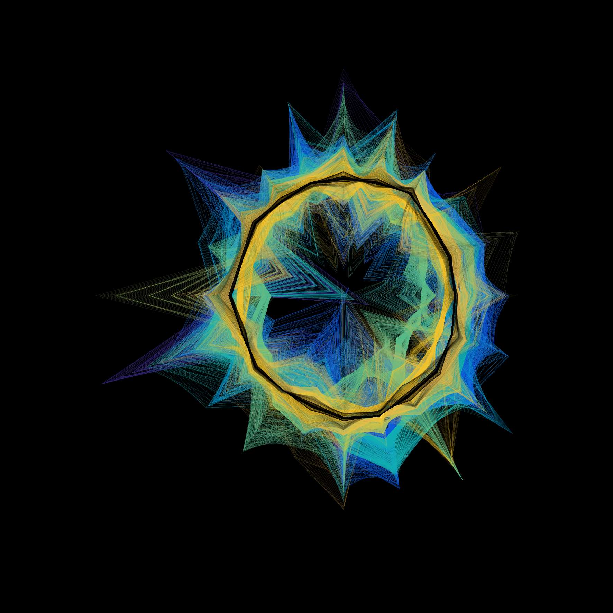
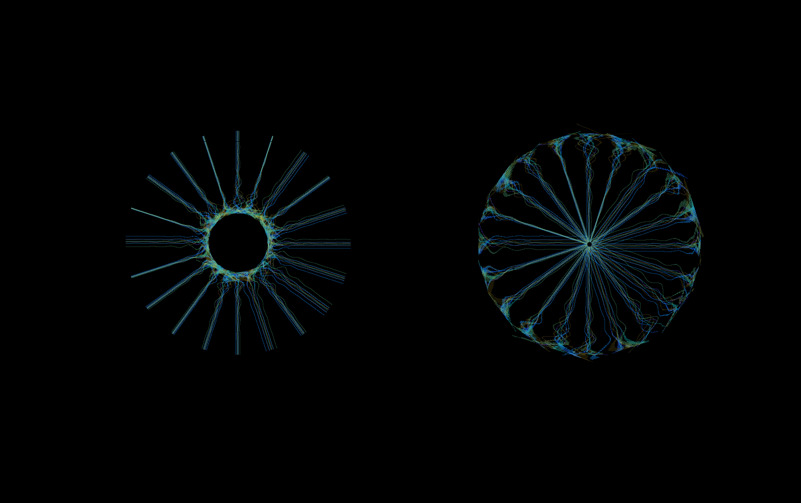
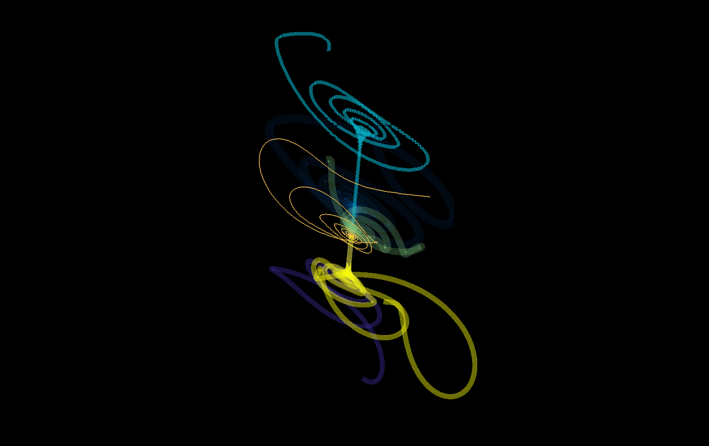
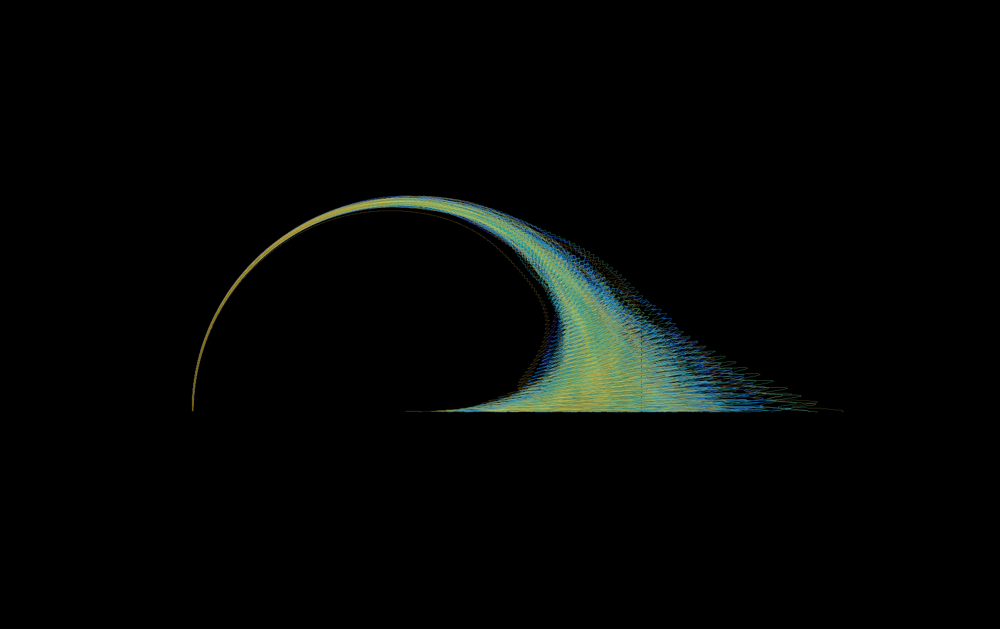

# Dynamicart

Pool of routines to explore visually interesting stuff associated with dynamical systems theory.


```matlab
H = rss(20,1,1,1);
dynart.ex_polar_traj(H, 20);
dynart.ex_star_traj(H, 20);
dynart.ex_bary_traj(H, 6);
dynart.ex_wheel_traj(H, 10);

```






